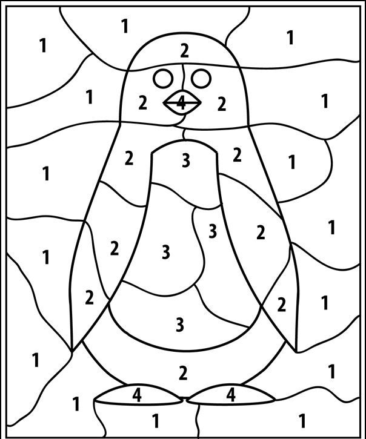

# Parte 7 - PSR

### Sumário

    Avaliação - PSR AR Paint

# PSR Augmented Reality Paint

Pretende-se desenvolver um conjunto de aplicações cuja funcionalidade
principal é permitir ao utilizador desenhar numa imagem movendo um
objeto colorido em frente à câmara do portátil.

As ferramentas a utilizar para o efeito são as que foram introduzidas em
aulas passadas (e.g. python, opencv, etc).

Deve desenvolver dois scripts distintos, um chamado
`color_segmenter.py` e o outro denominado `ar_paint.py`.

# Segmentação de cor - color_segmenter.py 

O programa `color_segmenter.py` servirá para configurar os parâmetros
da deteção de cor que serão depois utilizados pelo `ar_paint.py`. O
`color_segmenter.py` deve receber imagens continuamente da câmara do
portátil. Depois, essas imagems são processadas de modo a segmentar os
pixeis cuja cor esteja entre os limites mínimo e máximo de R,G e B
establecidos.

A aplicação deve ter 6 *trackbars* que permitam alterar esses limites, e
o programa deverá, quando se alteram aqueles valores, mostrar de
imediato o resultado da segmentação usando os novos limites.

Quando o utilizador estiver satisfeito com os valores indicados,
pressiona a tecla \"w\" (write) para indicar que quer guardar os limites
establecidos. O programa deve gravar esses limites num ficheiro json
denominado *limits.json* (colocado na diretoria local) com o seguinte
formato:

```python
{'limits': {'B': {'max': 255, 'min': 0},
            'G': {'max': 255, 'min': 0},
            'R': {'max': 255, 'min': 229}}}
```

O utilizador pode ainda usar a tecla \"q\" (quit) para indicar que quer
terminar o programa sem efetuar a gravação do ficheiro json.

Para facilitar a deteção de cor recomenda-se a utilização de um
telemóvel com o programa [full screen color
light](https://play.google.com/store/apps/details?id=com.nekobukiya.screenlight&hl=pt_PT)
(ou semelhante) que permite colocar uma cor no ecrã do telemóvel, e
depois virá-lo para a câmara do portátil.

Escolha uma cor a colocar e depois configure a segmentação de cor para
detetar essa cor.

**NOTA**: A segmentação por cor terá uma **valorização extra** se utilizarem o espaço de cores **HSV** corretamente.

# Desenho por realidade aumentada - ar_paint.py 

O script `ar_paint.py` deverá receber continuamente imagens da câmara.
Cada imagem é processada de modo a encontrar o objeto com a cor
predefinida. Depois, as coordenadas do centroide desse objeto são usadas
para determinar a posição detetada do lápis. Nessa posição é pintado um
ponto (ou uma linha) com a cor e o tamanho definidos. O processo
repete-se para cada imagem recebida.

### Inicialização

A fase de inicialização deve compreender as seguintes funcionalidades:

1.  Leitura dos argumentos da linha de comandos.

Apenas um argumento para indicar o nome do ficheiro json a ser lido (o
que foi escrito pelo `color_segmenter.py`).

```sh
$ ./ar_paint.py -j limits.json -h
usage: ar_paint.py [-h] -j JSON

Definition of test mode

optional arguments:
  -h, --help            show this help message and exit
  -j JSON, --json JSON  Full path to json file.
```

1.  Leitura do ficheiro json com os limites para segmentação de cor

2.  Fazer o setup da captura de video

3.  Criar uma imagem toda branca (tela) para desenhar do mesmo tamanho
    das imagens recebidas da câmara

4.  Outras inicializações que considere necessárias


### Operação em contínuo


A operação em contínuo é um conjunto de funcionalidades que são
repetidas ciclicamente. Neste contexto, o programa deve:

1.  Adquirir uma imagem da câmara

2.  Processar essa imagem de modo a obter uma máscara com os pixeis que
    têm a cor pretendida

Pode mostrar a máscara numa janela opencv dedicada para ser fácil de
perceber se a segmentação está a funcionar como pretendido.

1.  Processa a máscara da segmentação de cor de modo a obter uma máscara
    apenas com o objeto de maior àrea

Sugere-se a utilização dos [connected components do
opencv](https://stackoverflow.com/questions/35854197/how-to-use-opencvs-connected-components-with-stats-in-python),
mas certamente haverá outras alternativas.

Deve destacar o objeto de maior àrea pintado-o (por exemplo a verde) na
imagem original.

1.  Calcular o centróide desse objeto

Mostre o centroide detetado desenhado uma cruz vermelha sobreposta na
imagem original.

1.  Usar o centroíde detetado para pintar, na imagem com a tela, uma
    linha ou um ponto com a cor e o tamanho definidos para o lápis (ver
    em baixo).

### Comandos por teclado


O programa deve ainda deve escutar as teclas e implementar as
funcionalidades descritas.

i.  tecla \"r\", para mudar a cor do lápis para vermelho

ii. tecla \"g\", para mudar a cor do lápis para verde

iii. tecla \"b\", para mudar a cor do lápis para azul

iv. tecla \"+\", para aumentar o tamanho do lápis

v.  tecla \"-\", para diminuir o tamanho do lápis

vi. tecla \"c\", para limpar (clear) a tela, voltando a colocá-la toda
    branca

vii. tecla \"w\", para gravar (write) a imagem atual

Gere automáticamente o nome do ficheiro da imagem tendo em conta a data
atual, e.g.

    drawing_Tue_Sep_15_10:36:39_2020.png

i.  tecla \"q\", para terminar o programa

### Funcionalidade avançada 1 - Use Shake Detection


Pretende-se que o programa desenhe linhas entre deteções consecutivas.
No entanto, por vezes a deteção de cor pode falhar e o objeto encontrado
com maior àrea pode oscilar de uma zona da imagem para outra. Quando
isto acontece, as linhas são desenhadas ao longo de toda a imagem o que
resulta num efeito visual desagradável (parecem sarrabiscos).

Para evitar este efeito pode desenvolver uma funcionalidade a que
chamaremos \"shake prevention\", que verifica se houve uma grande
oscilação na deteção do centróide e evita desenhar linhas nesse caso,
desenhando apenas um ponto na posição atual do centróide.

Esta funcionalidade deverá ser ativada através de um argumento da linha
de comandos (\"use_shake_prevention\").

O programa deve também permitir para facilitar os testes que o
utilizador use a posição do rato (e não a do centroide da cor detetada)
para definir o localização do lápis.


### Funcionalidade avançada 2 - Usar video stream como tela

Pretende-se substituir a tela branca pelas imagens capturadas
periódicamente pela camara.

### Funcionalidade avançada 3 - Desenhar formas na tela


Pretende-se que o programa consiga desenhar rectângulos e círculos (ou
elipses) na tela. Para o efeito o utilizador terá de premir a tecla
correspondente (s ou e para *square* ou *ellipse*) e enquanto a tecla
está premida e a posição do centroide varia é possivel ver a forma a
alterar. Por exemplo, se o utilizador pressionar a tecla \"o\" para
indicar que quer desenhar um circulo na posição do centroide x=100,
y=100, então o círculo terá centro nestas coordenadas e o raio será dado
pela distância ente o centro e a posição do centroide quando a tecla
\"o\" for libertada. Ver funcionalidade de desenhos do zoom. O zoom
permite desenhar elipses e não círculos, pelo que o primeiro clique não
define o centro mas sim um dos cantos da elipse. Faça apenas a
funcionalidade de desenhar círculos como sugerido em cima.

Uma explicação em video [aqui](https://youtu.be/BRjUW17GcoE).

### Funcionalidade avançada 4 - Pintura numerada


Pretende-se que o programa divida a tela em várias zonas, cada uma com
um número que corresponde a uma cor (pode fazer-se quando é premida uma
tecla ou num modo especial quando se usa um argumento da linha de
comandos). Ver o exemplo da imagem em baixo (deve-se usar imagens com
menos regiões).




### Funcionalidade avançada 5 - Avaliação da pintura numerada

Depois de terminar a pintura numerada, o utilizador pode
pedir ao programa para avaliar o resultado. Para o fazer o programa deve
estimar a precisão com que o utilizador pintou a cor correta para cada
zona, calculando um score de qualidade da pintura em função disso.

# Vídeo com exemplo 
Pode ver este [vídeo](https://youtu.be/ud119RI_Rpg) com um exemplo do
que se pretende. As funcionalidades avançadas 3,4 e 5 não estão
presentes no vídeo.
