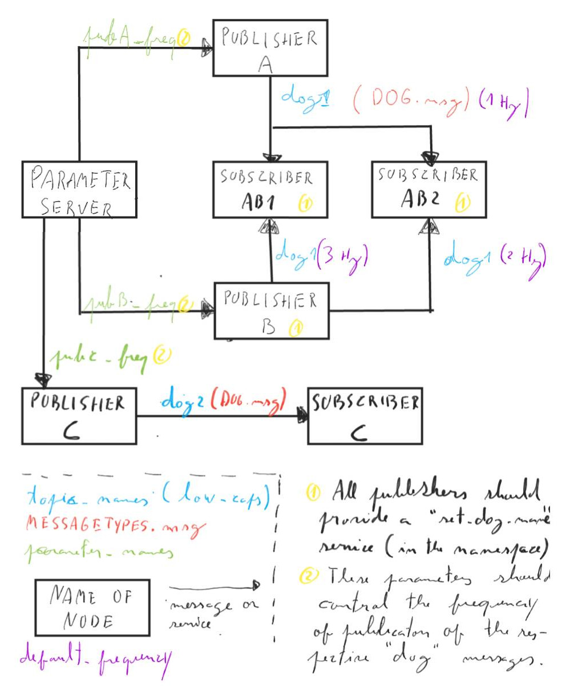
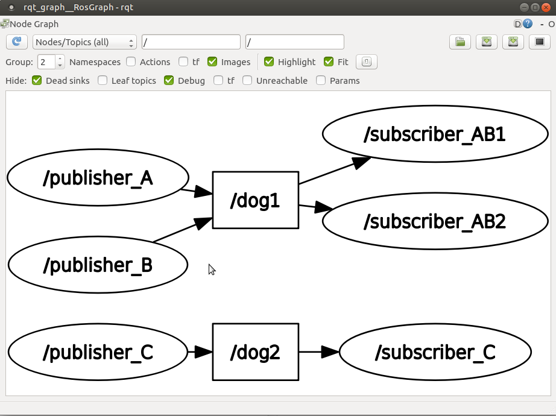

# Parte 9 - PSR

### Sumário

    Configuração de nós em ROS - nomes e parâmetros
    Ficheiros ros launch
    Ficheiros de log em ros

# Exercício 1 - Remapeamento de nomes

O ROS tem como uma das suas características fundamentais a possibilidade
de reutilização de código. Assim, de modo a permitir o lançamento de
vários nós a partir de um único código é importante conseguir alterar os
nomes de várias entidades do código.

Um exemplo: para lançar dois nós ROS a partir do mesmo código, é
necessário que não tenham o mesmo nome. Uma solução é a que foi
utilizada na aula passada com nomes anónimos, mas também é possível
remapear o nome do nó quando este é lançado.

um *nome* em ROS é um conjunto alargado de propriedades dos nós, e
[todas elas podem ser remapeadas](http://wiki.ros.org/Names). Um exemplo
é o nome do nó, mas também se pode [remapear nomes de tópicos, serviços
ou parâmetros](http://wiki.ros.org/Remapping%20Arguments).

Neste exercício pretende-se alterar o código do exercício 3 da aula
passada de modo a que seja possível alterar o nome do nó *publisher.py*
bem como o tópico em que publica.

**Exemplo de chamada o publicador com remapeamento de nome de nó,
tópicos e serviços**

``` bash
rosrun psr_aula9_ex1 publisher.py chatter:=my_chat __name:=my_node ~set_dog_name:=set_my_dog_name
```

O remapeamento de nomes em ROS colide com o argument parser. Apesar de
ser possível colocar os dois a funcionar em simultâneo (usando a
funcionalidade
[parse_known_args](https://www.kite.com/python/docs/argparse.ArgumentParser.parse_known_args)),
isso não é relevante para esta aula, e portanto sugere-se a remoção do
argument parser.

# Exercício 2 - Parâmetros em ROS

*ROS params* são variáveis que são definidas no início do programa (ou
mesmo durante a execução, em softwares mais avançados) e que configuram
o comportamento do nó. O ROS aborda o problema da parametrização de nós
de uma forma distribuída (em linha com a filosofia geral). Assim, há um
nó chamado [*parameter server*](http://wiki.ros.org/Parameter%20Server)
que tem a função de guardar o valor de cada parâmetro e de
disponibilizar um serviço que permita ler e escrever o valor desses
parâmetros. Deste modo qualquer nó consegue consultar o valor de um
parâmetro usando um destes serviços.

Crie um novo parâmetro em ROS chamado *highlight_text_color*, que irá
definir a cor a usar para destacar texto nos nós publisher.py e
subscriber.py. o valor deste parâmetro deverá ser uma string com uma das
cores [disponíveis na biblioteca
colorama.Fore](https://stackoverflow.com/questions/61686780/python-colorama-print-all-colors)


Pode criar o parâmetro com o comando *rosparam*, e.g.:

``` Bash
rosparam set highlight_text_color GREEN
```

e depois pode consultar a lista de parâmetros:

``` Bash
rosparam list
```

finalmente, pode ainda ler o valor de um parâmetro:

``` Bash
rosparam get highlight_text_color
```


Partindo do exercício anterior, adapte de modo a que os scripts
*publisher.py* e *subscriber.py* imprimam as suas mensagens com a cor
configurada no parâmetro acima descrito.

Os programas devem [ler o
parâmetro](http://wiki.ros.org/rospy/Overview/Parameter%20Server)
durante a inicialização.


É possível também que os nós sejam notificados quando houver uma
alteração do valor do parâmetro, mas essa [solução é mais
complexa](http://library.isr.ist.utl.pt/docs/roswiki/ROSNodeTutorialPython.html)
e não é relevante para esta aula.


# Exercício 3 - Parâmetros privados

Adicione um parâmetro privado do nó *publisher.py* que permita alterar a
frequência de publicação.

# Exercício 4 - Ficheiro de Parâmetros

O ROS permite ainda a leitura de um [ficheiro do tipo
*yaml*](https://roboticsbackend.com/ros-param-yaml-format/) com um
conjunto de parâmetros e seus respetivos valores. Esta solução é útil
quando se tem dezenas ou mesmo centenas de parâmetros.

Crie um ficheiro yaml numa pasta *params* na raiz do seu package.


**Exemplo do ficheiro params/params.yaml**

``` Yaml
highlight_text_color: "MAGENTA"
my_name: "Miguel"
```

e depois leia o ficheiro com o comando:

``` Bash
rosparam load params.yaml
```

# Exercício 5 - Ficheiros roslaunch

Os [ficheiros roslaunch](http://wiki.ros.org/roslaunch) são usados como
scripts para lançamento e configuração de multiplos nós ros. Têm várias
[funcionalidades úteis](http://wiki.ros.org/roslaunch/XML), como
argumentos de entrada, possibilidade de chamar outros launch files,
remapeamento de nomes, set de parâmetros, etc.

Suponha que, numa reunião de kick-off de um projeto de software é
discutida a implementação de um sistema com vários programas e
parâmetros de configuração. A título de exemplo vamos continuar a
utilizar os nós dos últimos exercícios. Dessa reunião resultou o
seguinte esboço:



Crie um ROS package com o nome *psr_aula9_ex4_bringup* (bringup é um
sufixo normalmente dado aos ros packages que fazem o lançamento de
sistemas). Nesse pacote, na pasta *launch* crie um *bringup.launch* que
faça o lançamento do sistema esquematizado.

**Exemplo de um launch file simples.**

``` xml
<launch>
  <node name="talker" pkg="rospy_tutorials" type="talker" />
</launch>
```

Posteriormente, utilize o *rqt_graph* para inspecionar o sistema e
verificar que está conforme com o esboço.




Os nós devem imprimir para o terminal (ver [opções do
\<node\>](http://wiki.ros.org/roslaunch/XML/node)).

Pode incluir o rqt_graph também no launch file.

Pode ver exemplos de launch files mais complexos, por exemplo no caso do
[AtlasCar2](https://github.com/lardemua/atlascar2/tree/master/atlascar2_bringup/launch).


# Exercício 6 - Logging em ROS

Um *log* é um ficheiro que regista vários eventos que ocorreram durante
a sessão de gravação do log. Um dos problemas das aplicações robóticas é
muitas vezes a dificuldade em lidar com harware, uma vez que este nem
sempre está disponível, ou o processo de inicialização do mesmo é
complexo e moroso. Por outro lado, os dados reais recolhidos por
hardware não são repetidos (existe sempre uma flutuação nos dados). Isto
impede a afinação de um algoritmo usando sempre os mesmos dados de
entrada.

[O ROS implementa um sistema de logging](http://wiki.ros.org/rosbag)
suportado na sua arquitetura distribuida: o que é gravado são as
mensagens que são enviadas entre nós. O utilizador pode escolher que
mensagens devem ser gravadas, e o ficheiro criado pelo processo de
gravação (um *bagfile*) pode depois posteriormente ser lido
sequencialmente recreando o tráfego de mensagens ocorrido durante a
sessão gravada. Isto confere grande flexibilidade ao sistema de logging.

Usando a [command line interface para bag
files](http://wiki.ros.org/rosbag/Commandline) e partindo do exercício
anterior, grave um bag de cerca de meio minuto com os tópicos *dog1* e
*dog2*.

Depois, numa nova sessão (lembre-se que deve desligar o roscore entre
sessões) lance um sistema em que os publicadores são suprimidos, mas as
mensagens nos tópicos *dog1* e *dog2* são publicadas pelo playback do
bag file que foi previamente gravado.


**Exemplo do output do comando *rosbag info
\<bagfile_gravado_neste_exercício\>*.**


``` bash
➜  ~ rosbag info 2020-09-25-12-06-27.bag
path:        2020-09-25-12-06-27.bag
version:     2.0
duration:    6.3s
start:       Sep 25 2020 12:06:27.61 (1601031987.61)
end:         Sep 25 2020 12:06:33.94 (1601031993.94)
size:        9.6 KB
messages:    39
compression: none [1/1 chunks]
types:       psr_aula8_ex4/Dog [d3e481097da3769123b9dd1b566c9cb3]
topics:      dog1   26 msgs    : psr_aula8_ex4/Dog (2 connections)
             dog2   13 msgs    : psr_aula8_ex4/Dog
```

Sugestão para o launch file: adicione um argumento de entrada
*run_publishers* cujo valor determina se os nós publicadores são
lançados e, caso não sejam, seja lançado o playback de um bagfile.


# Exercício 7 - Visualização de um bagfile

Descarregue este
[bagfile](https://drive.google.com/file/d/1ILWRdSnRWpq3lWjgLCzMH5-o-abw2x8r/view?usp=sharing),
inspecione-o com o *rosbag info* e faça o seu playback.

Visualize as mensagens publicadas com o *rostopic echo* e outras
ferramentas.


