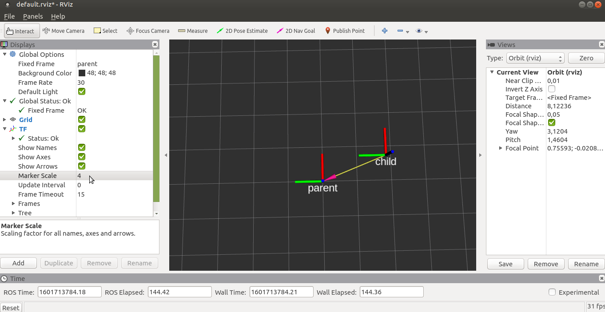
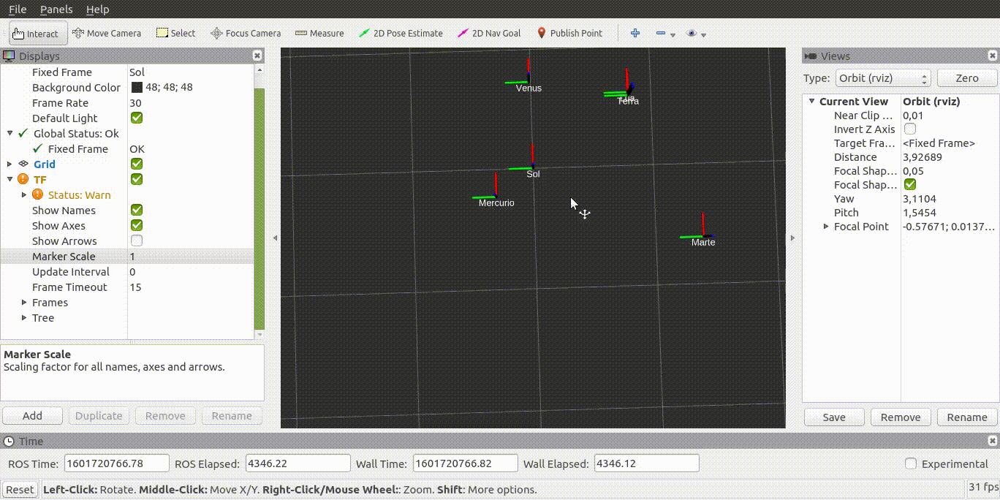
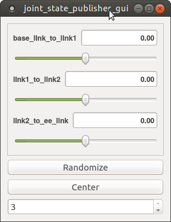

# Parte 11 - PSR

### Sumário

    Transformações geométricas em ROS
    Visualização de transformações geométricas
    Robot State Publisher
    Robot Description
    URDF e Xacro files

Visualize primeiro [esta exposição](https://youtu.be/xm_otUvbaX8)
teórica sobre matrizes de tranformação geométricas e a sua aplicação em
ROS.

A bilioteca em ROS que implementa o sistema de transformações
geométricas distribuídas chama-se **tf**, e vai já na segunda versão
(**tf2**). Por convenção, as transformações que estão no sistema são
todas publicadas no tópico */tf*. Os publicadores de transformações
chamam-se *transform publishers*, e os nós que pretendem obter
informação sobre as transformações são os *transform listeners*. Quando
se instancia um transform listener o nó subscreve o tópico */tf* e
sempre que recebe uma mensagem com transformações atualiza o buffer
local de transformações. Para obter uma transformação utiliza-se a
função **lookupTransform**, que utiliza esse buffer local e a
metodologia exposta na explicação teórica para obter a transformação
solicitada.

Os sistemas robóticos podem por vezes ter àrvores bastante complexas,
com dezenas de transformações encadeadas umas nas outras. Em baixo um
exemplo do AtlasCar e as todos os sistemas de referência considerados
para este sistema.


# Exercício 1 - tutoriais tf2

Faça os tutoriais de [tutoriais de
tf2](http://wiki.ros.org/tf2/Tutorials) para python.

# Exercício 2 - Criação de uma àrvore de transformações

Escreva um nó python chamado *circular_frame.py* que utiliza os
parâmetros locais *parent* e *child* para publicar periodicamente a
transformação de *parent* para *child* de modo a que o sistema de
refência *child* se mova em circulos à volta da origem de *parent*.

Confirme com o RViz que as transformações estão a ser publicadas. Pode
adicionar dois displays do tipo *Axes*, uma para o *parent* e outro para
o *child*, ou em alternativa utilize o display *TF* que visualiza todas
as transformações no sistema.



# Exercício 3 - Publicação de transformações

Escreva um launch file que lance nós a partir do código do exercício
anterior. Esses nós devem ter os nomes dos planetas internos (telúricos)
do sistema solar (Mercúrio, Venus, Terra e Marte) e seus satelites, e
devem estar encadeados de acordo com as órbitas de cada um. Quer isto
dizer que por exemplo a Terra deverá ter como sistema de coordenadas pai
o Sol, e que a Lua deverá ter como sistema de coordenadas pai a Terra.

Assuma as seguintes simplificações (aproximação de engenheiro):

1.  As órbitas como sendo circulares;

2.  Não são considerados os dois satelites de Marte, Phobos e Deimos;

3.  Assuma que o sistema solar é planar (z=0).

Aqui tem a [informação
necessária](https://nssdc.gsfc.nasa.gov/planetary/factsheet/planet_table_ratio.html)
sobre as distâncias dos planetas ao corpo celeste em torno do qual
orbitam. Visualize também a àrvore de transformações usando o rqt ou as
ferramentas do package *tf*.




::: informalexample
Para efeitos de melhor visualização, recomenda-se que multiplique por
0.01 todas as velocidades, e que multiplique por 10 a distância da terra
à lua.
:::

# Exercício 4 - Leitura de transformações

Escreva um nó em python chamado *mercury_to_moon.py* que verifique
periodicamente a distância de Mercúrio à Lua e a imprima no terminal.

# Exercício 5 - Universal Robot Description Format

O **U**niversal **R**obot **D**escription **F**ormat é o standard para
representação de robôs usado pelo ROS. Os robôs são descritos como uma
cadeia cinemática, ou seja, uma àrvore de sistemas de coordenadas
ligados por transformações. estáticas ou móveis. Em URDF is sistemas de
coordenadas são os *link1* e as transformações podem ser obtidas através
da informação contida nas *joints*.

Para se ambientar com a sintaxe do URDF [faça este
tutorial](http://wiki.ros.org/urdf/Tutorials/Building%20a%20Visual%20Robot%20Model%20with%20URDF%20from%20Scratch)
e [também
este](http://wiki.ros.org/urdf/Tutorials/Building%20a%20Movable%20Robot%20Model%20with%20URDF).

::: informalexample
Os tutoriais para URDF estão em: <http://wiki.ros.org/urdf/Tutorials>
:::

# Exercício 6 - Um Robô Scara

Os robôs SCARA são robôs com cadeias cinemáticas simples, tipicamente
compostas por duas juntas rotacionais seguidas de uma junta prismática.
Quase todas as grandes marcas têm SCARAs disponíveis no mercado, como é
o caso da
[FANUC](https://www.fanuc.eu/pt/pt/rob%c3%b4s/p%c3%a1gina-filtro-rob%c3%b4s/scara-series/scara-sr-12ia)
ou da
[ABB](https://new.abb.com/products/robotics/industrial-robots/irb-910sc).

Escreva um ficheiro *scara.urdf* do robô scara esquematizado na figura.
Siga os nomes especificados no esquema e invente os valores que
considerar adequados para o comprimento dos elos, largura, etc.


Crie um novo package ROS psr_parte11_scara_description
(\<robot_name\>\_description é o nome habitualmente dado aos packages
que contêm os ficheiros URDF). Dentro desse package crie uma pasta urdf
e coloque o ficheiro URDF lá dentro.


Para validar o urdf pode correr o comando:

    rosrun urdfdom_py display_urdf scara.urdf

# Exercício 7 - Robot State Publisher

Como vimos acima, a descrição URDF de um robô contem *links* ligados
entre si por *joints*. Se uma junta for estática, então a transformação
geométrica que lhe corresponde é calculada uma vez e será sempre
conhecida. No caso de a junta ser dinâmica é necessário recalcular a
cinemática direta do robô para cada novo valor de junta recebido.

O **robot_state_publisher** é o nó ROS responsável por realizar este
processo. Este nó subscreve mensagens com o valor das juntas
(*sensor_msgs/JointState*) e sempre que uma junta é atualizada recalcula
a transformação geométrica associada e publica a transformação
resultante no tópico */tf*.

Este nó é muito flexível, visto que consegue derivar a cinemática direta
de qualquer robô a partir da descrição do ficheiro URDF. O nó não lê o
ficheiro URDF mas sim um parâmetro ROS denominado **/robot_description**
(por convenção) criado a partir desse ficheiro. Para criar o parâmetro
*/robot_description* a partir do urdf pode fazer:

    rosparam set /robot_description "`rosrun xacro xacro scara.urdf`"

As plicas (\`\`) indicam à *shell* que deve recolher o resultado do
comando, e não o texto literal.

Pode agora lançar o **robot_state_publisher**:

    rosrun robot_state_publisher robot_state_publisher

e um nó para verificar se o **robot_state_publisher** está a publicar
transformações, e.g.:

    rostopic echo /tf

Verificará que ainda não há transformações no sistema. A razão é a de
que, como discutido acima, o **robot_state_publisher** necessita de
valores de juntas para depois calcular (e publicar) as transformações.

Num sistema real (neste momento estamos a simular um robô) haveriam
outros nós ROS responsáveis por fazer a interface com o hardware e
publicar os valores medidos das juntas (estes nós tipicamente são
chamados de *drivers*).

Neste caso devemos então substituir os *drivers* que não estão
presentes, lançando o *joint_state_publisher*, que é um nó que lê a
descrição do robot no parâmetro */robot_description*, anota as juntas
não fixas e, para cada uma, lança um slider para que o utilizador possa
escolher manualmente o valor atual da junta.

    rosrun joint_state_publisher_gui joint_state_publisher_gui

Agora deverá ver transformações a serem enviadas no tópico */tf*. Pode
também escutar as mensagens das juntas no tópico *joint_states*.



# Exercício 8 - Display.launch

Pode, para tornar o processo de lançamento de nós do exercício anterior
mais fácil, lançar todos aqueles nós com um launch file semelhante a
este. Adapte o que achar conveniente.


**robot.launch**
``` xml
<?xml version="1.0"?>
<launch>
  <arg name="model" default="$(find urdf_tutorial)/urdf/01-myfirst.urdf"/>
  <arg name="gui" default="true"/>
  <param name="robot_description" command="$(find xacro)/xacro.py $(arg model)"/>
  <param name="use_gui" value="$(arg gui)"/>
  <node name="joint_state_publisher" pkg="joint_state_publisher" type="joint_state_publisher"/>
  <node name="robot_state_publisher" pkg="robot_state_publisher" type="state_publisher"/>
</launch>
```

# Exercício 9 - Visualização

Para visualização deve escrever um launch file que lance o RViz
indicando o local do ficheiro de configuração para não perder as
configurações sempre que reiniciar o sistema. Adapte o launch file como
achar conveniente:


**visualize.launch**
``` xml
<?xml version="1.0"?>
<launch>
  <arg name="rvizconfig" default="$(find urdf_tutorial)/rviz/urdf.rviz"/>
  <node name="rviz" pkg="rviz" type="rviz" args="-d $(arg rvizconfig)" required="true"/>
</launch>
```

No RViz pode adicionar vários *displays* já conhecidos como o *TF*, o
*AXIS*, o *GRID*, mas acrescente também o *RobotModel* que é um display
que permite ver o robô usando a sua descrição.

Como já deve ter reparado, tem agora dois launch files, *robot.launch* e
*visualize.launch*. Isto é normal. O que se deve fazer é criar um novo
launch file (o que raiz normalmente chama-se bringup.launch) que chame
estes launch files.

# Exercício 10 - PR2

Explore os sistemas de coordenadas do PR2, lançando este
[bagfile](https://drive.google.com/file/d/1lWIOeEOJvzJzY_M_nGW4fMTqSXaZJzt4/view?usp=sharing)
e visualizando o robot.


# Exercício 11 - Xacro files

Os [ficheiros
xacro](http://wiki.ros.org/urdf/Tutorials/Using%20Xacro%20to%20Clean%20Up%20a%20URDF%20File)
são uma linguagem que permite escrever de forma mais fácil (ou com mais
funcionalidades) ficheiros urdf de representação do robô. Aqui [outro
link
interessante](https://ni.www.techfak.uni-bielefeld.de/files/URDF-XACRO.pdf).

Substitua o ficheiro *scara.urdf* por um ficheiro *scara.urdf.xacro*.

Verifique se o sistema continua a funcionar.
