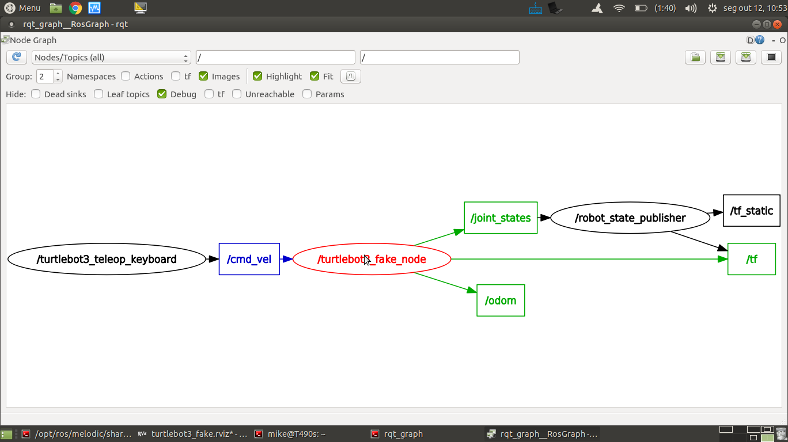
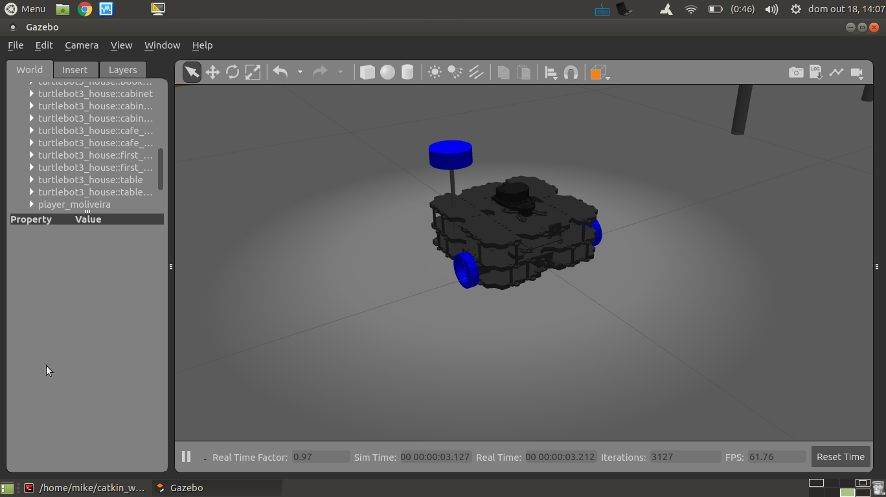
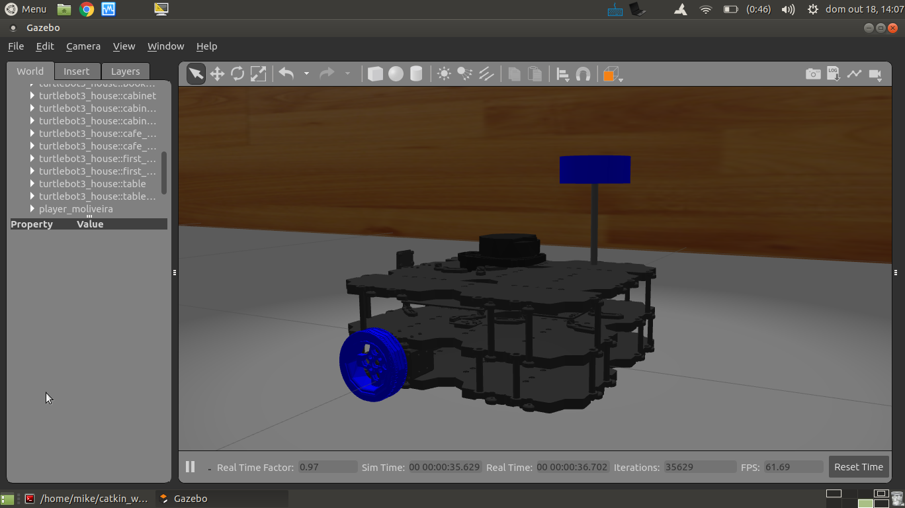
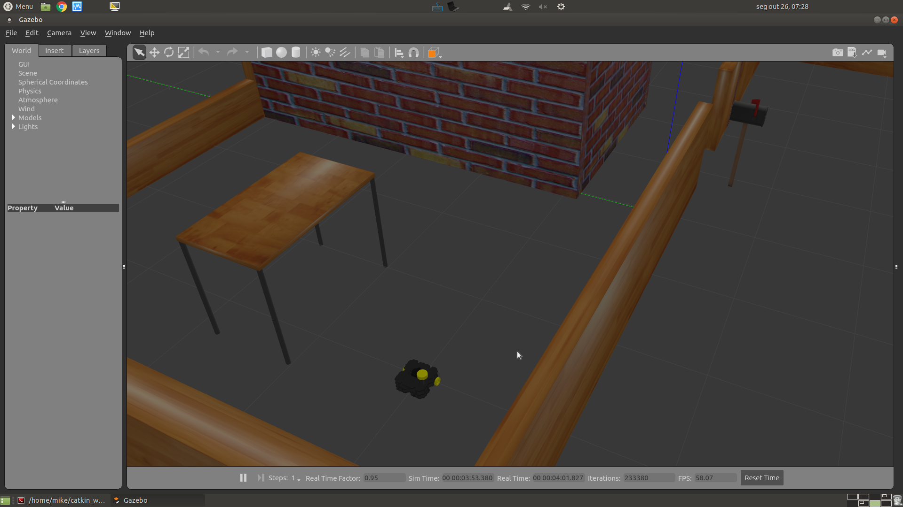
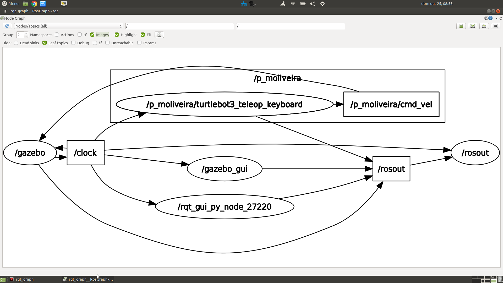

# Parte 12 - PSR

### Sumário

    Modelo cinemático diferencial
    Simulação usando o gazebo
    Turtlebot3


Explore o site to turtlebot3 antes da aula para se familiarizar com o
robô e as várias ferramentas.

<https://emanual.robotis.com/docs/en/platform/turtlebot3/overview/>

Outro link útil é:
<https://automaticaddison.com/how-to-launch-the-turtlebot3-simulation-with-ros/?fbclid=IwAR2l6Jd1E4GLdlt_ClWRMoyh8Rl8SNGxdPIyjIvgg1mOeBn-Xn4si9XrP80>


Pretende-se utilizar o Turtlebot3 em modo simulado. O modo de simulação
implica que o robô real seja substituído por um programa que, quando em
execução, se comporta como o robô real. Obviamente que o programa
simulador pode ter mais ou menos funcionalidades, imitando com mais ou
menos detalhe e precisão o robô real.


Em todos os exemplos, vamos usar o modelo do turtlebot3 chamado
**waffle_pi**.

Adicione ao seu *.bashrc* uma variável que contenha essa informação,
como explicado
[aqui](https://emanual.robotis.com/docs/en/platform/turtlebot3/export_turtlebot3_model/).


# Exercício 1 - Simulador simples

Neste primeiro exercício vamos utilizar o
[turtlebot3_fake](http://wiki.ros.org/turtlebot3_fake), que é um nó que
ao executar recebe mensagens de comando
([geometry_msgs/Twist](http://docs.ros.org/api/geometry_msgs/html/msg/Twist.html))
e publica mensagens de
[sensor_msgs/JointState](http://docs.ros.org/api/sensor_msgs/html/msg/JointState.html)
com a posição das rodas a cada instante.

Este nó calcula a posição atual do robô em função de um modelo
matemático da [cinemática diferencial do
robô](http://rossum.sourceforge.net/papers/DiffSteer/DiffSteer.html).
Por outras palavras, calcula o deslocamento do robô a cada instante e
publica a posição atual em mensagens de transformações
([tf2_msgs/TFMessage](http://docs.ros.org/api/tf2_msgs/html/msg/TFMessage.html)).



Para lançar o nó e o Rviz, execute:

    roslaunch turtlebot3_fake turtlebot3_fake.launch

e depois, para lançar a tele-operação execute:

    roslaunch turtlebot3_teleop turtlebot3_teleop_key.launch

Usando a operação manual, faça o robô andar em círculos como indicado no
vídeo.


# Exercício 2 - Simulador Gazebo

A segunda forma de simular um robô é utilizando um simulador genérico
como o [gazebo](http://gazebosim.org/). O gazebo é um simulador capaz de
simular qualquer robô, partindo de uma descrição do mesmo baseada no
formato URDF (ou outro bastante similar). O gazebo tem funcionalidades
avançadas como simulação de sensores, i.e., consegue gerar dados de
sensors em função do sensor e sua localização na cena. Outra
funcionalidade é o motor físico.

Faça os exemplos da secção [TurtleBot3 Simulation using
Gazebo](https://emanual.robotis.com/docs/en/platform/turtlebot3/simulation/#ros-1-simulation).

Os launch files para o lançamento da simulação do turtlebot3 em gazebo
são muito parecidos. Analisemos o caso do
[turtlebot3_house.launch](https://github.com/ROBOTIS-GIT/turtlebot3_simulations/blob/master/turtlebot3_gazebo/launch/turtlebot3_house.launch).


**turtlebot3_house.launch**
``` xml
<launch>
    <!--Bloco 1: argumentos do launch file.-->
    <arg name="model" default="$(env TURTLEBOT3_MODEL)" doc="model type [burger, waffle, waffle_pi]"/>
    <arg name="x_pos" default="-3.0"/>
    <arg name="y_pos" default="1.0"/>
    <arg name="z_pos" default="0.0"/>

    <!--Bloco 2: Criação de um world om gazebo.-->
    <include file="$(find gazebo_ros)/launch/empty_world.launch">
        <arg name="world_name" value="$(find turtlebot3_gazebo)/worlds/turtlebot3_house.world"/>
        <arg name="paused" value="false"/>
        <arg name="use_sim_time" value="true"/>
        <arg name="gui" value="true"/>
        <arg name="headless" value="false"/>
        <arg name="debug" value="false"/>
    </include>

    <!--Bloco 3: Carregamento do xacro do robot para o parâmetro robot_description.-->
    <param name="robot_description" command="$(find xacro)/xacro --inorder $(find turtlebot3_description)/urdf/turtlebot3_$(arg model).urdf.xacro" />

    <!--Bloco 4: Spawning (criação instantânea) do robô definido pela descrição anteriormente carregada para o robot_description, para uma posição específica da cena. -->
    <node name="spawn_urdf" pkg="gazebo_ros" type="spawn_model" args="-urdf -model turtlebot3 -x $(arg x_pos) -y $(arg y_pos) -z $(arg z_pos) -param robot_description" />
</launch>
```

Existem 4 blocos principais:

1.  O primeiro é o de definição de argumentos de entrada do launch file;

2.  O segundo bloco é o de lançamento do gazebo e criação de uma cena;

3.  O terceiro bloco carrega a descrição do robô para um parâmetro ros;

4.  O quarto bloco inicializa o robô algures algures no mundo do gazebo.

No segundo bloco é chamado um outro launch file denominado
[empty_world.launch](https://github.com/ros-simulation/gazebo_ros_pkgs/blob/kinetic-devel/gazebo_ros/launch/empty_world.launch),
que inicia os programas gazebo servidor e cliente (a parte gráfica).

Este launch file contém o argumento
[world_name](https://github.com/ros-simulation/gazebo_ros_pkgs/blob/a63566be22361fa1f02ebcca4a9857d233e1c2ac/gazebo_ros/launch/empty_world.launch#L18),
que é o que define a cena a ser usada. Em gazebo, uma cena é definida
por um ficheiro com um formato chamado
[scene_description_format](http://sdformat.org/spec?ver=1.7&elem=world)
(extensão *.sdf* ou *.world*). Este formato é semelhante ao já estudado
[urdf](http://wiki.ros.org/urdf) (também é em formato *xml*) mas a
informação que contem descreve não apenas o robô mas toda a cena, não só
os objetos físicos como a casa, mas também a luz ambiente, o motor
físico a usar etc. Em baixo o exemplo do ficheiro que define a cena da
casa:


**turtlebot3_house.world**
``` xml
<sdf version='1.4'>
  <world name='default'>
    <!-- A global light source -->
    <include>
      <uri>model://sun</uri>
    </include>

    <!-- A ground plane -->
    <include>
      <uri>model://ground_plane</uri>
    </include>

    <physics type="ode">
      <real_time_update_rate>1000.0</real_time_update_rate>
      <max_step_size>0.001</max_step_size>
      <real_time_factor>1</real_time_factor>
      <ode>
        <solver>
          <type>quick</type>
          <iters>150</iters>
          <precon_iters>0</precon_iters>
          <sor>1.400000</sor>
          <use_dynamic_moi_rescaling>1</use_dynamic_moi_rescaling>
        </solver>
        <constraints>
          <cfm>0.00001</cfm>
          <erp>0.2</erp>
          <contact_max_correcting_vel>2000.000000</contact_max_correcting_vel>
          <contact_surface_layer>0.01000</contact_surface_layer>
        </constraints>
      </ode>
    </physics>

    <!-- A turtlebot symbol -->
    <include>
      <uri>model://turtlebot3_house</uri>
    </include>

    <scene>
      <ambient>0.4 0.4 0.4 1</ambient>
      <background>0.7 0.7 0.7 1</background>
      <shadows>true</shadows>
    </scene>

    <gui fullscreen='0'>
      <camera name='user_camera'>
        <pose>0.0 0.0 17.0 0 1.5708 0</pose>
        <view_controller>orbit</view_controller>
      </camera>
    </gui>
  </world>
</sdf>
```

O terceiro bloco do *turtlebot3_house.launch* é o que carrega o xacro
com a descrição do robô para o parâmetro *robot_description*.

O *xacro* do turtlebot3 é o
[seguinte](https://github.com/ROBOTIS-GIT/turtlebot3/blob/master/turtlebot3_description/urdf/turtlebot3_waffle_pi.urdf.xacro):


**turtlebot3_waffle_pi.urdf.xacro**
``` xml
<?xml version="1.0" ?>
<robot name="turtlebot3_waffle_pi" xmlns:xacro="http://ros.org/wiki/xacro">
  <xacro:include filename="$(find turtlebot3_description)/urdf/common_properties.xacro"/>
  <xacro:include filename="$(find turtlebot3_description)/urdf/turtlebot3_waffle_pi.gazebo.xacro"/>

  <link name="base_footprint"/>

  <joint name="base_joint" type="fixed">
    <parent link="base_footprint"/>
    <child link="base_link" />
    <origin xyz="0 0 0.010" rpy="0 0 0"/>
  </joint>

  <link name="base_link">
    <visual>
      <origin xyz="-0.064 0 0.0" rpy="0 0 0"/>
      <geometry>
        <mesh filename="package://turtlebot3_description/meshes/bases/waffle_pi_base.stl" scale="0.001 0.001 0.001"/>
      </geometry>
      <material name="light_black"/>
    </visual>

    <collision>
      <origin xyz="-0.064 0 0.047" rpy="0 0 0"/>
      <geometry>
        <box size="0.266 0.266 0.094"/>
      </geometry>
    </collision>

    <inertial>
      <origin xyz="0 0 0" rpy="0 0 0"/>
      <mass value="1.3729096e+00"/>
      <inertia ixx="8.7002718e-03" ixy="-4.7576583e-05" ixz="1.1160499e-04"
               iyy="8.6195418e-03" iyz="-3.5422299e-06"
               izz="1.4612727e-02" />
    </inertial>
  </link>

  <joint name="wheel_left_joint" type="continuous">
    <parent link="base_link"/>
    <child link="wheel_left_link"/>
    <origin xyz="0.0 0.144 0.023" rpy="-1.57 0 0"/>
    <axis xyz="0 0 1"/>
  </joint>

  <link name="wheel_left_link">
    <visual>
      <origin xyz="0 0 0" rpy="1.57 0 0"/>
      <geometry>
        <mesh filename="package://turtlebot3_description/meshes/wheels/left_tire.stl" scale="0.001 0.001 0.001"/>
      </geometry>
      <material name="dark"/>
    </visual>

    <collision>
      <origin xyz="0 0 0" rpy="0 0 0"/>
      <geometry>
        <cylinder length="0.018" radius="0.033"/>
      </geometry>
    </collision>

    <inertial>
      <origin xyz="0 0 0" />
      <mass value="2.8498940e-02" />
      <inertia ixx="1.1175580e-05" ixy="-4.2369783e-11" ixz="-5.9381719e-09"
               iyy="1.1192413e-05" iyz="-1.4400107e-11"
               izz="2.0712558e-05" />
      </inertial>
  </link>

  <joint name="wheel_right_joint" type="continuous">
    <parent link="base_link"/>
    <child link="wheel_right_link"/>
    <origin xyz="0.0 -0.144 0.023" rpy="-1.57 0 0"/>
    <axis xyz="0 0 1"/>
  </joint>

  <link name="wheel_right_link">
    <visual>
      <origin xyz="0 0 0" rpy="1.57 0 0"/>
      <geometry>
        <mesh filename="package://turtlebot3_description/meshes/wheels/right_tire.stl" scale="0.001 0.001 0.001"/>
      </geometry>
      <material name="dark"/>
    </visual>

    <collision>
      <origin xyz="0 0 0" rpy="0 0 0"/>
      <geometry>
        <cylinder length="0.018" radius="0.033"/>
      </geometry>
    </collision>

    <inertial>
      <origin xyz="0 0 0" />
      <mass value="2.8498940e-02" />
      <inertia ixx="1.1175580e-05" ixy="-4.2369783e-11" ixz="-5.9381719e-09"
               iyy="1.1192413e-05" iyz="-1.4400107e-11"
               izz="2.0712558e-05" />
      </inertial>
  </link>

  <joint name="caster_back_right_joint" type="fixed">
    <parent link="base_link"/>
    <child link="caster_back_right_link"/>
    <origin xyz="-0.177 -0.064 -0.004" rpy="-1.57 0 0"/>
  </joint>

  <link name="caster_back_right_link">
    <collision>
      <origin xyz="0 0.001 0" rpy="0 0 0"/>
      <geometry>
        <box size="0.030 0.009 0.020"/>
      </geometry>
    </collision>

    <inertial>
      <origin xyz="0 0 0" />
      <mass value="0.005" />
      <inertia ixx="0.001" ixy="0.0" ixz="0.0"
               iyy="0.001" iyz="0.0"
               izz="0.001" />
    </inertial>
  </link>

  <joint name="caster_back_left_joint" type="fixed">
    <parent link="base_link"/>
    <child link="caster_back_left_link"/>
    <origin xyz="-0.177 0.064 -0.004" rpy="-1.57 0 0"/>
  </joint>

  <link name="caster_back_left_link">
    <collision>
      <origin xyz="0 0.001 0" rpy="0 0 0"/>
      <geometry>
        <box size="0.030 0.009 0.020"/>
      </geometry>
    </collision>

    <inertial>
      <origin xyz="0 0 0" />
      <mass value="0.005" />
      <inertia ixx="0.001" ixy="0.0" ixz="0.0"
               iyy="0.001" iyz="0.0"
               izz="0.001" />
    </inertial>
  </link>

  <joint name="imu_joint" type="fixed">
    <parent link="base_link"/>
    <child link="imu_link"/>
    <origin xyz="0.0 0 0.068" rpy="0 0 0"/>
  </joint>

  <link name="imu_link"/>

  <joint name="scan_joint" type="fixed">
    <parent link="base_link"/>
    <child link="base_scan"/>
    <origin xyz="-0.064 0 0.122" rpy="0 0 0"/>
  </joint>

  <link name="base_scan">
    <visual>
      <origin xyz="0 0 0.0" rpy="0 0 0"/>
      <geometry>
        <mesh filename="package://turtlebot3_description/meshes/sensors/lds.stl" scale="0.001 0.001 0.001"/>
      </geometry>
      <material name="dark"/>
    </visual>

    <collision>
      <origin xyz="0.015 0 -0.0065" rpy="0 0 0"/>
      <geometry>
        <cylinder length="0.0315" radius="0.055"/>
      </geometry>
    </collision>

    <inertial>
      <mass value="0.114" />
      <origin xyz="0 0 0" />
      <inertia ixx="0.001" ixy="0.0" ixz="0.0"
               iyy="0.001" iyz="0.0"
               izz="0.001" />
    </inertial>
  </link>

  <joint name="camera_joint" type="fixed">
    <origin xyz="0.073 -0.011 0.084" rpy="0 0 0"/>
    <parent link="base_link"/>
    <child link="camera_link"/>
  </joint>

  <link name="camera_link">
    <collision>
      <origin xyz="0.005 0.011 0.013" rpy="0 0 0"/>
      <geometry>
        <box size="0.015 0.030 0.027"/>
      </geometry>
    </collision>
  </link>

  <joint name="camera_rgb_joint" type="fixed">
    <origin xyz="0.003 0.011 0.009" rpy="0 0 0"/>
    <parent link="camera_link"/>
    <child link="camera_rgb_frame"/>
  </joint>
  <link name="camera_rgb_frame"/>

  <joint name="camera_rgb_optical_joint" type="fixed">
    <origin xyz="0 0 0" rpy="-1.57 0 -1.57"/>
    <parent link="camera_rgb_frame"/>
    <child link="camera_rgb_optical_frame"/>
  </joint>
  <link name="camera_rgb_optical_frame"/>

</robot>
```

# Exercício 3 - Robot Description

O trabalho prático vai consistir no desenvolvimento de um robô simulado
para a realização de várias tarefas num apartamento simulado. O Trabalho
tem o nome de código **robutler** (robô mordomo).

Pretende-se criar um robô baseado no *turtlebot3* modelo *waffle_pi*
para utilizar no trabalho prático que será apresentado posteriormente.

Todos os pacotes relativos ao robutler devem iniciar com esse nome, como
por exemplo **robutler_description**.

Crie um novo *ros package* denominado **robutler_description**. Nesse
package crie uma pasta urdf e coloque lá dentro os ficheiros urdf e
xacro de que vai necessitar.

Crie (ou copie do
[turtlebot3_description](https://github.com/ROBOTIS-GIT/turtlebot3/tree/master/turtlebot3_description))
os xacros necessários de modo a que o seu robô tenha elementos como uma
cor distinta to default. Para alterar a cor de elementos deve ver [este
tutorial](http://wiki.ros.org/urdf/Tutorials/Building%20a%20Visual%20Robot%20Model%20with%20URDF%20from%20Scratchf).

Numa primeira fase, os ficheiros a copiar são:

-   common_properties.xacro

-   turtlebot3_waffle_pi.gazebo.xacro

-   turtlebot3_waffle_pi.urdf.xacro

De acordo com a filosofia do ROS, deve-se reaproveitar o máximo o código
já feito. Assim, deve copiar apenas os ficheiros do package
*turtlebot3_description/urdf* que vai alterar. Todos os outros que ficam
inalterados deverão ser importados do pacote ROS original.

**Altere os nomes e o conteúdo dos ficheiros como apropriado** Em baixo
um sumário dos ficheiro presentes no package **robutler_description**.

``` bash
robutler_description
├── CMakeLists.txt
├── package.xml
├── src
└── urdf
    ├── common_properties.xacro
    ├── robutler.gazebo.xacro
    └── robutler.urdf.xacro
```

# Exercício 4 - Robot Bringup

Crie um novo ros package chamado **robutler_bringup** onde coloca três
launch files dentro da pasta launch.

-   Um primeiro launch file chamado **gazebo.launch** deverá lançar o
    gazebo (o bloco 2 do turtlebot3_house.launch

-   Um segundo launch file chamado **bringup.launch**, os blocos 1 e 3
    do turtlebot3_house.launch.

-   Um terceiro launch file chamado **spawn.launch** deverá fazer o
    spawn do robot (o bloco 4 do turtlebot3_house.launch)

O bringup.launch deve chamar o spawn.launch devidamente configurado.

Em baixo um sumário dos ficheiro presentes no package
\_p_moliveira_bringup.

**package p_moliveira_bringup.**
``` bash
p_moliveira_bringup
├── CMakeLists.txt
├── launch
│   ├── gazebo.launch
│   └── spawn.launch
│   └── bringup.launch
├── package.xml
└── src
```

Para correr o sistema deve lançar o gazebo:

    roslaunch robutler_bringup gazebo.launch

e depois fazer o bringup do seu robô

    roslaunch robutler_bringup bringup.launch

As imagens em baixo mostram o robô. Neste caso optou-se por colocar as
rodas do robô a azul, e acrescentar uma \"antena\" com um cilindro da
mesma cor.





Exercício 5 - Robot state publisher

Adicione ao bringup.launch o lançamento do nó robot_state_publisher.

# Exercício 6 - Visualização com RViz

O RViz é um visualizador de mensagens ROS. Neste caso, o RViz irá
funcionar como uma janela para o que cada robô vê, ao contrário do
Gazebo que contem toda a informação, incluindo a que não está acessível
ao robô.

Pretende-se criar um **visualize.launch** dentro do package
**robutler_bringup**, que execute o rviz carregando uma configuração
pré-gravada.


**visualize.launch**
``` xml
<launch>
    <!-- Launch rviz, loading configuration file -->
    <node name="rviz" pkg="rviz" type="rviz"
          args="--display-config $(find robutler_bringup)/config/visualize.rviz" required="false"/>
</launch>
```

adicione uma chamada deste **visualize.launch** no ficheiro
**bringup.launch**

## Ex 6a

Configure o display **RobotModel** no RViz.

Uma vez que os parâmetros, tópicos e tfs estão sob o namespace do robô,
é necessário configurar o valor dos parâmetros para obter uma correta
visualização.

## Ex 6b

Configure um display **Image** para visualização das imagens (simuladas)
da câmara.

## Ex 6c

Configure um display **LaserScan** para visualização das dados
(simulados) da Lidar.




# Exercício 7 - player teleop

O robô lançado no exercício anterior pode ser conduzido manualmente com
o teleop usando o comando:

    roslaunch turtlebot3_teleop turtlebot3_teleop_key.launch

Crie no package *\<player_name\>\_bringup* um **teleop.launch** the faça
a teleoperação do seu robô.

Pode também conduzir o seu robô com um comando da playstation ou xbox,
ou mesmo do seu telefone android. Consulte [estas
instruções](https://emanual.robotis.com/docs/en/platform/turtlebot3/teleoperation/#teleoperation)
e se quiser aumente o launch file para, com argumentos de entrada, ser
possível definir o modo de teleoperação.

O grafo de computação do exercício anterior mostra que o package
*turtlebot3_teleop_keyboard* envia mensagens para o *gazebo* no tópico
*/cmd_vel*. Executando o comando:



    rostopic type /p_moliveira/cmd_vel

e a resposta será que essas mensagens são do tipo *geometry_msgs/Twist*.
O package [geometry_msgs](http://wiki.ros.org/geometry_msgs)
disponibiliza mensagens para várias primitivas geométricas, tais como
pontos, vectores, poses, etc. A mensagem *Twist* expressa um vetor de
velocidade com as duas componentes linear e angular.

**geometry_msgs/Twist**
``` msg
# This expresses velocity in free space broken into its linear and angular parts.
Vector3  linear
Vector3  angular
```

Uma vez que estamos a falar de um vetor de velocidade a 2D, para mover o
robô é necessário explicitar apenas a *componente x* da velocidade
linear e a *componente z* da velocidade angular.

Um exemplo de uma mensagem enviada pelo teleop:

**exemplo de mensagem cmd_vel para turtlebot3**
``` bash
linear:
  x: 0.21
  y: 0.0
  z: 0.0
angular:
  x: 0.0
  y: 0.0
  z: 1.82
```

Pode também publicar mensagens de comando a partir do terminal:

**exemplo de publicação de cmd_vel usando o rostopic pub**
``` bash
 rostopic pub /cmd_vel geometry_msgs/Twist "linear:
  x: 0.0
  y: 0.0
  z: 1000.0
angular:
  x: 0.0
  y: 0.0
  z: 100.0" --rate 10
```

# Exercício 8 - Utilização do psr_apartment como world

Primeiro deve fazer o clone dos repositórios
<https://github.com/aws-robotics/aws-robomaker-small-house-world> e
<https://github.com/aws-robotics/aws-robomaker-hospital-world> para
dentro do catkin workspace:

    cd catkin_ws/src
    git clone https://github.com/aws-robotics/aws-robomaker-small-house-world
    git clone https://github.com/aws-robotics/aws-robomaker-hospital-world

Utilize o world psr_apartment. Para isso coloque o pacote ros
**psr_apartment_description** (está no github de psr) no seu catkin
workspace. Depois pode indicar o caminho para o ficheiro
psr_apartment.world.

No final deve recompilar o seu workspace antes de lançar.

# Exercício 9 - Corrida com comando manual
A ideia é realizar uma corrida com o robô em modo de teleoperação. O
ponto de partida é a cozinha, sendo que o robô deve ir pela sala, dar a
volta ao corredor e regressar à cozinha.
