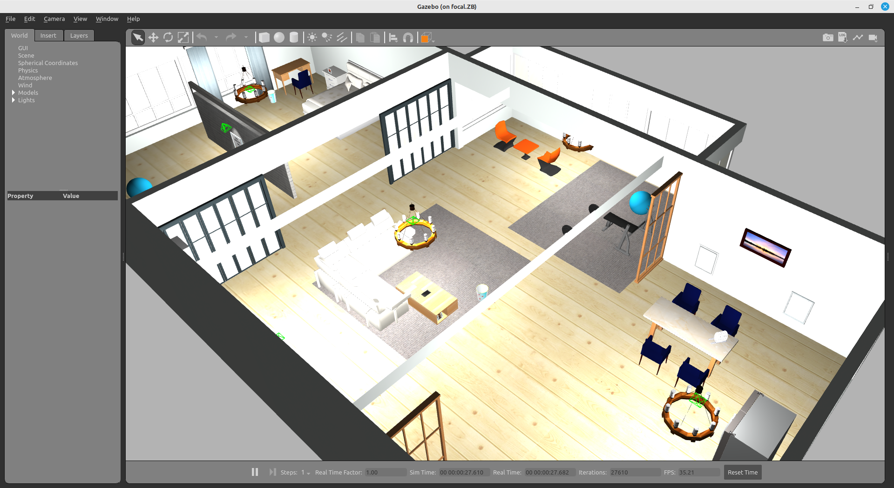
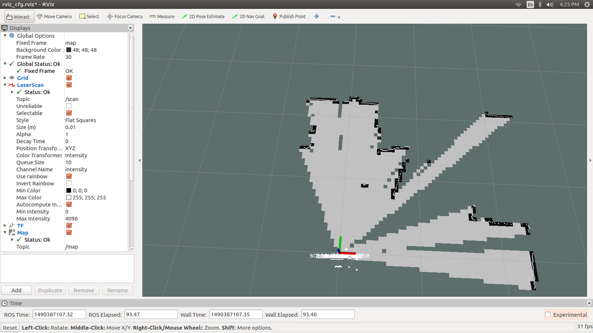
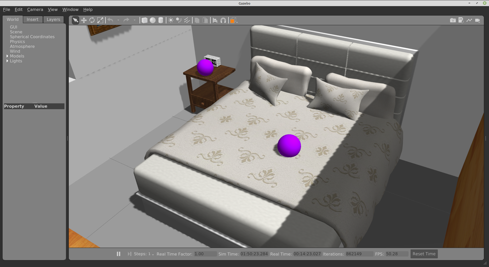
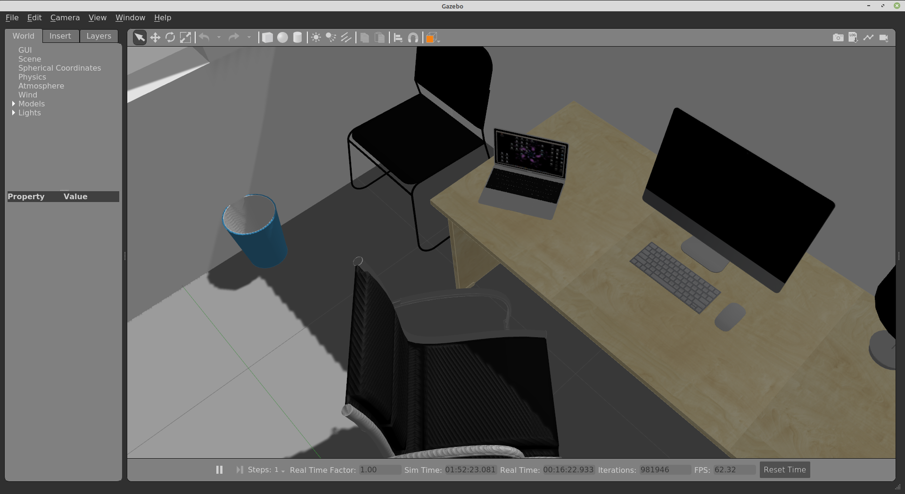
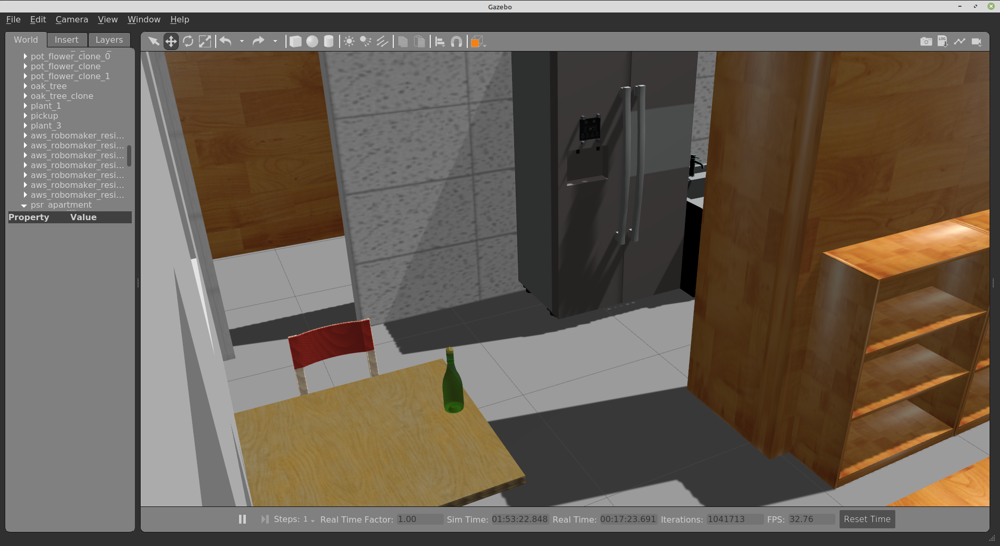
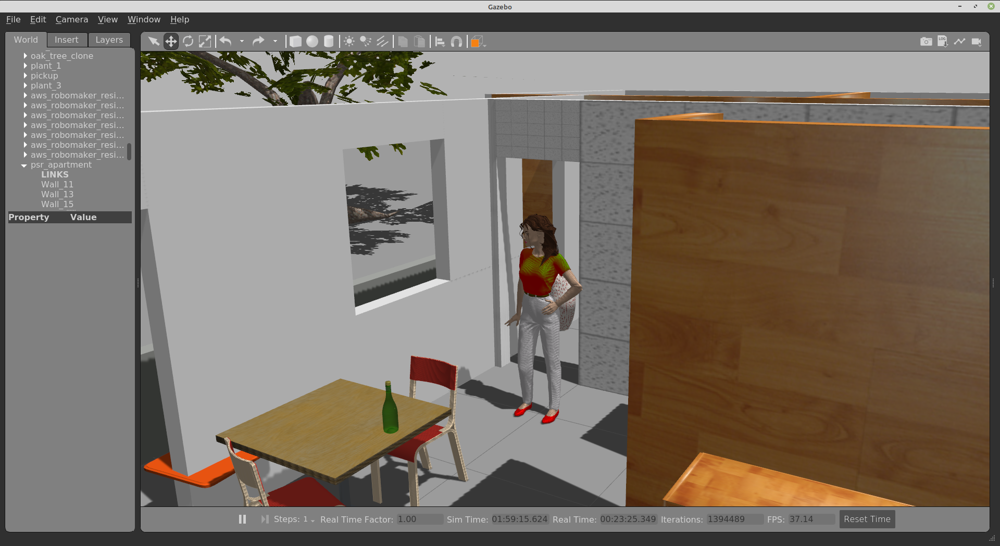

# Trabalho 3 - Robutler

Miguel Riem Oliveira <mriem@ua.pt>
Eurico Pedrosa <efp@ua.pt>

## Sumário

Pretende-se desenvolver um sistema robótico que funcione como um mordomo.
O Robô deve ser capaz de realizar variadas missões de apoio habitualmente realizadas por trabalhadores humanos.

O robô deve ter desenvolvidas várias funcionalidades que suportem a operacionalização destas missões, tais como a perceção de objetos e a movimentação no cenário.

## Cenário de testes

O cenário de testes é chamado **AWS small house**, e é um apartamento T2 simulado em Gazebo.

O pacote ROS **aws_robotmaker_small_house_world**  está incluído no github da UC.
Para lançar o cenário pode utilizar o seguinte comando:

    roslaunch aws_robotmaker_small_house_world view_small_house.launch

O que deverá mostrar um ambiente como o da imagem seguinte:

[.text-center]
.PSR Apartment no Gazebo.

## Objetivos

A avaliação será feita em função da apresentação do grupo no exame de época normal ou de recurso. Os alunos deverão preparar a apresentação no sentido de cobrir o mais possível os objetivos / funcionalidades abaixo listadas.

### Configuração do robô

O robô deve ser baseado num turtlebot waffle pi. No entanto, esta plataforma terá de ser modificada de modo a que seja possível ao robô ter informação adequada para cumprir as suas missões. Em particular poderá ser necessário alterar / acrescentar sensores bem como o seu posicionamento.

### Mapeamento do Cenário

O cenário deverá ser mapeado com SLAM, e esse mapa offline utilizado como suporte à localização e navegação autónoma.

[.text-center]
.SLAM.

### Movimentação do robô pelo apartamento

Deverá ser possível movimentar o robô pelo apartamento de várias formas distintas:

    - Por condução manual com teleop (pode ser útil criar um teleop com interface melhorado);
    - Por condução autónoma para um alvo expresso em coordenadas X,Y;
    - Por condução autónoma para um alvo expresso com informação semântica, e.g. "vai para a cozinha";
    - Outras formas.

### Perceção

A perceção pode utilizar os sensores que se considerem mais adequados. O Objetivo é que o robô seja capaz de identificar vários objetos, pessoas ou locais em função dos dados adquiridos pelo sensor.

A perceção base pode ser baseada em reconhecimento de cor para encontrar objetos de cor única, como é o caso das esferas violeta mostradas abaixo.

[.text-center]
.Deteção de objetos simples.

Podem ser incluídos objetos mais desafiantes como um portátil ou uma garrafa:

[.text-center]
.Deteção de um portátil.

[.text-center]
.Deteção de uma garrafa.

Finalmente podem também ser detetadas pessoas pelo robô, como por exemplo:

[.text-center]
.Deteção de uma pessoa.

### Spawn de objetos na casa

Pretende-se criar uma funcionalidade que consiga adicionar objetos à casa em posições não conhecidas pelo robô. Para isso é utilizado um serviço disponibilizado pelo gazebo. O script deverá permitir usar argumentos para definir o que será criado e em que divisão do apartamento, ou então deve sortear um objeto e uma de entre várias localizações pré-configuradas.

### Missões Passivas

Se as funcionalidades acima descritas estiverem implementadas o robô conseguirá desempenhar várias missões.
Deverá ser possível iniciar uma missão utilizando um menu com marcadores interativos RViz:

http://wiki.ros.org/rviz/Tutorials/Interactive%20Markers%3A%20Getting%20Started#menu

Deverá também acrescentar texto próximo do robô a indicar a missão que este está atualmente a desempenhar.

Exemplos de missões:

   - Mover para quarto, mover para sala;
   - Procurar uma esfera vermelha no quarto pequeno;
   - Verificar se o computador portátil está no escritório;
   - Verificar se está alguém no quarto grande;
   - Verificar se a mesa da sala está levantada (livre de objetos);
   - Fotografar a divisão X;
   - Verificar se alguém está em casa;
   - Contar o número de cubos azuis existentes em casa;
   - Outras que considerem interessantes.

### Missões Ativas (Muito Avançado)

Como funcionalidades avançadas, sugere-se que o robô seja capaz não só de observar mas também de interagir com o meio ambiente. A interação pode ser básica ou mais evoluída. Alguns exemplos:

   - Tocar no objeto X;
   - Deitar o objeto X abaixo da mesa na divisão Y;
   - Agarrar a lata de coca-cola do quarto e colocá-la no balde do lixo do escritório;
   - Outras que considerem relevantes.

